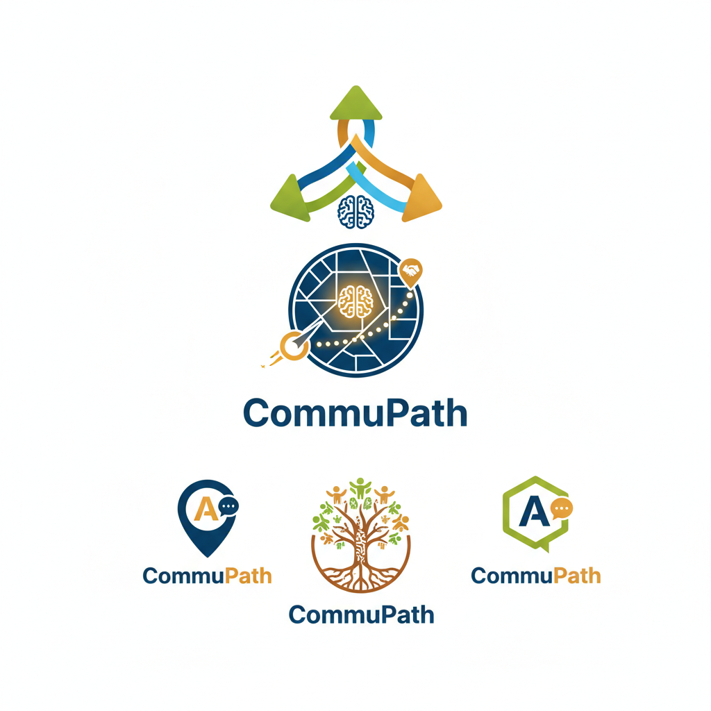

# CommuPath 🌍

**Geo-Social AI Agent Platform for Community Impact**

CommuPath transforms New Year's resolutions into collective community impact through AI-coordinated local quests.


## 🎯 Project Vision

CommuPath uses AI agents to:
- 🎯 Identify local community needs based on GPS coordinates
- 📍 Generate location-specific "Impact Quests"
- 👁️ Verify completion through multimodal reasoning (images + text)
- 🏆 Gamify community engagement with leaderboards and points

## 🏗️ Tech Stack

### Frontend
- **React 18** + **TypeScript** - Type-safe UI components
- **Vite** - Lightning-fast build tool
- **Tailwind CSS** - Utility-first styling with custom design system
- **React Router** - Client-side routing
- **React Leaflet** - Interactive maps for geospatial visualization
- **Heroicons** - Beautiful SVG icons
- **Shadcn UI** - Modern, accessible UI components

### Backend (Coming in Milestones 1-4)
- **FastAPI** - Modern Python web framework
- **Google Gemini 2.5 Pro** - Advanced reasoning and vision
- **Google Gemini 2.5 Flash** - Fast evaluations
- **Opik SDK** - LLM observability and tracing
- **SQLAlchemy** - ORM for database management

## 🚀 Getting Started

### Prerequisites
- Node.js 18+ 
- npm or yarn
- Python 3.9+ (for backend - Milestones 1+)

### Installation

1. **Clone the repository**
   ```bash
   cd commupath
   ```

2. **Install frontend dependencies**
   ```bash
   npm install
   ```

3. **Run the development server**
   ```bash
   npm run dev
   ```

4. **Open in browser**
   Navigate to [http://localhost:5173](http://localhost:5173)

## 📖 Project Structure

```
commupath/
├── src/
│   ├── components/
│   │   └── Layout.tsx          # Main layout with sidebar
│   ├── context/
│   │   └── AppContext.tsx      # Global state management
│   ├── pages/
│   │   ├── ImpactMap.tsx       # Interactive map with quests
│   │   ├── QuestHub.tsx        # Quest management dashboard
│   │   └── Leaderboard.tsx     # Community leaderboard
│   ├── App.tsx                 # Main app with routing
│   ├── main.tsx                # Entry point
│   └── index.css               # Global styles
├── backend/                    # Coming in Milestone 1
├── vite.config.ts              # Vite configuration
├── tailwind.config.js          # Tailwind customization
└── package.json
```

## 🎮 Features (Milestone 0 - UI Scaffolding) ✅

### 📍 Impact Map
- Interactive Leaflet map centered on Ibadan, Nigeria
- Quest markers showing community impact opportunities
- Location search and category filtering (Environment, Social, Education, Health)
- "Scan for Quests" button using browser geolocation API
- "Ask Architect for Quest" placeholder (will connect to Gemini in Milestone 1)

### 📋 Quest Hub
- Tabbed interface: Active, In Progress, Completed quests
- Beautiful quest cards with difficulty badges
- File upload for proof submission (drag-and-drop support)
- Image preview before submission
- Modal interface for submitting proof of impact

### 🏆 Leaderboard
- Top community heroes ranked by points
- Global impact summary (total points, quests, heroes)
- Weekly impact story (AI-generated in Milestone 4)
- Award badges for top 3 performers (🥇🥈🥉)
- Animated table with smooth transitions



## 🛠️ Development Roadmap

### ✅ Milestone 0: UI Scaffolding (In progress)
- React + Vite + Tailwind CSS setup
- Three main pages with premium design
- Mock data and state management
- Interactive maps with React Leaflet

### 🔄 Milestone 1: The Architect Core (In progress)
- FastAPI backend setup
- Gemini 2.5 Pro integration
- Quest generation API
- Connect frontend to backend

### 📊 Milestone 2: Opik Instrumentation (Next)
- Opik SDK integration
- `@track` decorators for tracing
- LLM-as-a-judge for safety evaluation
- Observability dashboard

### 👁️ Milestone 3: Multimodal Verification
- Gemini 2.5 Pro Vision integration
- Image-based proof verification
- Confidence scoring
- Point awarding system

### 🗄️ Milestone 4: Persistence & Reporting
- SQLAlchemy database setup
- User and quest persistence
- Real-time leaderboard updates
- AI-generated community impact reports

## 🔑 Environment Variables (For Milestones 1+)

Create a `.env` file in the `backend/` directory:

```env
GEMINI_API_KEY=your_gemini_api_key_here
OPIK_API_KEY=your_opik_api_key_here
OPIK_WORKSPACE=your_workspace_name
OPIK_URL_OVERRIDE=https://www.comet.com/opik/api
```

## 🧪 Testing (To be added)

### Manual Testing Checklist
- [ ] Navigate between all three pages
- [ ] Test map interactions (zoom, pan, markers)
- [ ] Click "Scan for Quests" to test geolocation
- [ ] Upload an image in Quest Hub
- [ ] View quest details in popups
- [ ] Check leaderboard animations

### Automated Tests (Coming Soon)
- Component tests with Vitest
- E2E tests with Playwright
- API tests for backend endpoints

## 📝 Key Commands

```bash
# Install dependencies
npm install

# Run development server
npm run dev

# Build for production
npm run build

# Preview production build
npm run preview

# Lint code
npm run lint
```

## 🤝 Contributing

Contributions, suggestions, and feedback are welcome!

## 📄 License

MIT License - Built with ❤️ for community impact

## 🙏 Acknowledgments

- **Google Gemini** - For powerful AI capabilities
- **Comet.ml (Opik)** - For LLM observability tools
- **OpenStreetMap** - For mapping data

---

*Making New Year's resolutions count through AI-powered community impact*
