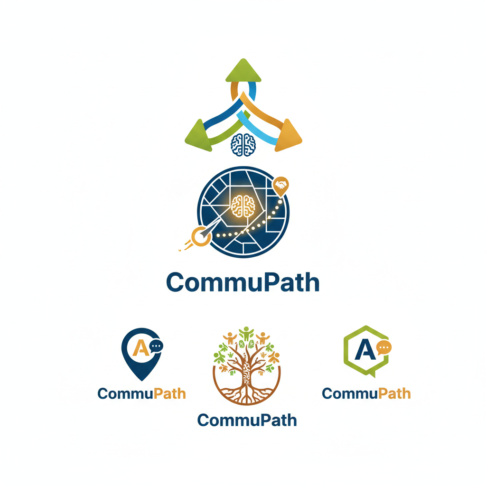

# CommuPath 🌍

**Geo-Social AI Agent Platform for Community Impact**

CommuPath transforms New Year's resolutions into collective community impact through AI-coordinated local quests, powered by the Stellar Blockchain.


## 🎯 Project Vision

CommuPath uses AI agents to:
- 🎯 **Identify** local community needs based on GPS coordinates
- 📍 **Generate** location-specific **Impact Quests** (e.g., Mapo Hall cleanup, UI campus maths. mentoring)
- 👁️ **Verify** completion through multimodal reasoning (images + text + videos) via Gemini
- ⛓️ **Settle** rewards instantly and transparently using Stellar & Soroban smart contracts
- 🏆 **Gamify** community engagement with on-chain leaderboards and verifiable impact badges

## 🏗️ Tech Stack

### Frontend & AI
- **React 18** + **TypeScript** - Type-safe UI components
- **Vite** - Lightning-fast build tool
- **Google Gemini  2.5 Pro/Flash** - Advanced reasoning, vision, and fast evaluations
- **Opik SDK** - LLM observability and agent tracing.

### Blockchain
- **Soroban (Rust)** - Smart contracts for quest state management and reward distribution
- **Stellar SDK** - For seamless wallet integration and sub-cent transaction settlements
- **Stellar Aid Assist Logic** - Utilizing Stellar's proven architecture for transparent, real-world social impact

### Backend
- **FastAPI** - Modern Python web framework
- **SQLAlchemy** - ORM for local data persistence
- **Supabase** - Remote open-source Backend-as-a-Service (BaaS) platform built on top of PostgreSQL

## 🌊 Drips Wave Integration
CommuPath is participating in the **Stellar Wave Program** on Drips to accelerate development.

### For Contributors:

1. Check our (Issues)[https://github.com/emarc99/commupath-mvp/issues] for tags like `Stellar-Wave`.
2. Follow the "Fix, Merge, and Earn" cycle.
3. Earn Points for your contributions, which translate into **USDC rewards on Stellar** via the Drips Wave protocol.

## 🚀 Getting Started

### Prerequisites
- Node.js 18+ 
- npm or yarn
- Python 3.9+
- Stellar CLI (for Soroban contract deployment)
- Freighter Wallet (to interact with the MVP)

### Installation

1. **Clone the repository**
   ```bash
   git clone https://github.com/emarc99/commupath-mvp
   cd commupath
   ```

2. **Install frontend dependencies**
   ```bash
   npm install
   ```

3. **Deploy Soroban Contracts (Local Testnet)**
```bash
cd contracts
soroban contract deploy --wasm target/wasm32-unknown-unknown/release/commupath.wasm --source alice --network testnet
```

4. **Run the development server**
   ```bash
   npm run dev
   ```

## 📖 Project Structure

```
commupath/
├── src/
│   ├── components/
│   │   └── Layout.tsx          # Main layout with sidebar
│   ├── context/
│   │   └── AppContext.tsx      # Global state management
│   ├── pages/
│   │   ├── ImpactMap.tsx       # Interactive map with quests
│   │   ├── QuestHub.tsx        # Quest management dashboard
│   │   └── Leaderboard.tsx     # Community leaderboard
│   ├── App.tsx                 # Main app with routing
│   ├── main.tsx                # Entry point
│   └── index.css               # Global styles
├── backend/                    # Pyhton-based backend
├── soroban/                    # Soroban smart contracts/scripts
├── vite.config.ts              # Vite configuration
├── tailwind.config.js          # Tailwind customization
└── package.json
```

## 🎮 Features (Milestone 0 - UI Scaffolding) ✅

### 📍 Impact Map
- Interactive Google map centered on a location e.g. Ibadan, Nigeria
- Quest markers showing community impact opportunities
- Location search and category filtering (Environment, Social, Education, Health)
- Ask Architect for Quest: will connect to Gemini and personally relevant quests
- On-Chain Quests: Markers represent live smart contract instances
- Scan for Quests: Uses browser geolocation to find Soroban-verified impact opportunities near you.

### 📋 Quest Hub
- Tabbed interface: `Active`, `In Progress`, `Completed quests`
- Quest cards with difficulty badges
- Proof of Impact: Upload images/videos for Gemini-vision verification
- Smart Settlement: Once AI verifies the proof, a Soroban contract automatically triggers a reward payout to your Stellar address.

### 🏆 Leaderboard
- Top community heroes ranked by points
- Global impact summary (total points, quests, heroes)
- Weekly impact story (AI-generated)
- Verifiable Heroes: Rankings are pulled directly from the Stellar ledger
- Impact Badges: Top performers receive soulbound tokens (NFTs) on Stellar representing their community contributions



## 🛠️ Development Roadmap

### ✅ Milestone 0: UI Scaffolding
- React + Vite + Tailwind setup
- Interactive maps with Google Maps JS API

### 🔄 Milestone 1: The Architect & Soroban Core (In progress)
- FastAPI + Gemini 2.5 Pro for quest generation (Quest generation API)
- Soroban Smart Contract deployment for Quest state (`Active`/`Completed`/`Verified`)

### 📊 Milestone 2: Opik & Stellar Observability
- Opik SDK integration for tracing agent calls
- Integration of Stellar Horizon for monitoring on-chain quest completions

### 👁️ Milestone 3: Multimodal Verification
- Gemini 2.5/3.0 Pro Vision for image-based proof
- Auto-triggering Stellar transactions upon successful AI verification.

### 🗄️ Milestone 4: Persistence & Reporting
- SQLAlchemy database setup
- User and quest persistence
- Real-time leaderboard updates
- AI-generated community impact reports

## 🔑 Environment Variables (For Milestones 1+)

Create a `.env` file in the `backend/` directory:

```env
GEMINI_API_KEY=your_gemini_api_key_here
OPIK_API_KEY=your_opik_api_key_here
OPIK_WORKSPACE=your_workspace_name
OPIK_URL_OVERRIDE=https://www.comet.com/opik/api
```

## 🧪 Testing (To be added)

### Manual Testing Checklist
- [ ] Navigate between all three pages
- [ ] Test map interactions (zoom, pan, markers)
- [ ] Click "Scan for Quests" to test geolocation
- [ ] Upload an image in Quest Hub
- [ ] View quest details in popups
- [ ] Check leaderboard animations

### Automated Tests (welcome Soon)
- Component tests with Vitest
- E2E tests with Playwright
- API tests for backend endpoints

## 📝 Key Commands

```bash
# Install dependencies
npm install

# Run development server
npm run dev

# Build for production
npm run build

# Preview production build
npm run preview

# Lint code
npm run lint
```

## 🤝 Contributing

Contributions, suggestions, and feedback are always welcomee!

## 📄 License

MIT License - Built with ❤️ for community impacts

## 🙏 Acknowledgments


---

*Making New Year's resolutions count through AI-powered community impact*
